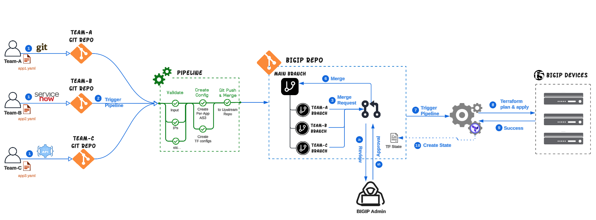

# Creating an Automation Framework for F5 BIGIP

In the modern era of IT, automation and infrastructure as code (IaC) have become very important in streamlining operations and enhancing the agility of organizations. Terraform, an open-source IaC tool, allows administrators to define and provision infrastructure using a high-level configuration language. When combined with F5 Per App AS3, a declarative configuration API for BIG-IP, the result is a powerful solution for managing application services more efficiently and consistently.

For F5 administrators, leveraging Terraform with AS3 can drastically reduce the time and effort required to deploy and manage application services. Automation not only minimizes human errors but also ensures that configurations are consistent across different environments. This enables organizations to respond quickly to changing business needs, scale their operations seamlessly, and maintain a high level of operational efficiency.

In this repository, we will explore five use cases, each being the evolution of the previous, demonstrating how customers can build  their own automation framework. Each use case offers a different level of automation and also provides additional benefits, such as audit trail, code reviews, and many more. This way, customers can choose what best fits their knowledge and experience with these tools. Whether you are new to automation or already skilled in IaC practices, these examples will help you make your F5 application deployment processes easier and more efficient.



The BIG-IP Automation Framework is structured into five distinct levels, allowing users to select the automation framework that best fits their needs based on both functionality and their skill levels. Each level is designed to build upon the previous one, progressively introducing more advanced concepts and capabilities. This tiered approach ensures that users can start with the basics and gradually advance to more sophisticated automation techniques as they become more comfortable and experienced. The levels include:

- **[Level 1 - Per App AS3 with Terraform](level-1/README.md)**. In this stage, users are exposed to the foundational concepts and practices for automating F5 BIG-IP systems. It is designed to help both new and experienced users to efficiently manage and automate their BIG-IP environments in a very simple manner. 
- **[Level 2 - Utilizing Git for Robust Version Control](level-2/README.md)**. In Level-2 we introduce Git version control capabilities that allows automation owners to track every change made to the codebase, making it easy to identify who made specific changes, when they were made, and why.
- **[Level 3 - Centralizing Terraform Execution with Pipelines and Remote State](level-3/README.md)**. The Level 3 focuses on enhancing F5 BIG-IP automation by introducing remote Terraform state and CI/CD pipelines. These additions ensure consistency, streamline deployment processes, and provide centralized management for infrastructure changes.
- **[Level 4 - Empowering Customers to Create Their Own Configurations](level-4/README.md)**. The Level 4 introduces collaboration features for F5 BIG-IP automation using Git branches and merge requests. These features enable multiple team members to work on different tasks simultaneously, review each other's work, and ensure high code quality before changes are merged into the main branch.
- **[Level 5 - Self Service Deployments](level-5/README.md)**. In `Level-5`, we enhance the automation framework to enable customers or teams to create their own configurations for the BIG-IP platform. In this scenario, each customer/team manages their own Git repository, where they can make changes and commit configurations.
- **[Level 6 - Full Lifecycle Self-Service](level-6/README.md)**. `Level 6` evolves the automation framework into a scalable, customer-centric solution supporting full lifecycle self-service by introducing NetOrca, an orchestration layer that abstracts service offerings from customer requests. This approach simplifies customer input, improves feedback, enhances service ownership, and streamlines the workflow from service definition to deployment. The result is a more flexible, scalable, and user-friendly automation framework that addresses the limitations of previous levels while providing a robust platform for managing complex, large-scale deployments.


## Table of Contexts

- [Introduction](#creating-an-automation-framework-with-per-app-as3)
- [Technologies used](#technologies-used)
  - [Working with AS3 and Terraform](#working-with-as3-and-terraform)
    - [Creating an AS3 resource](#creating-an-as3-resource)
    - [Modifying an AS3 resource](#modifying-an-as3-resource)
    - [Deleting an AS3 resource](#deleting-an-as3-resource)
  - [Best Practices](#best-practices-for-bigip-tmos)
- [Demo](#demo)  


## Technologies used

Based on the use-case (level) you choose, there could be up to four technologies that are used to build the automation framework. These are:

- **AS3**. AS3 provides a declarative interface, enabling the management of application-specific configurations on a BIG-IP system. By providing a JSON declaration rather than a series of imperative commands, AS3 ensures precise configuration orchestration. We utilize the latest Per-App AS3 feature to optimize configuration granularity. You can find more information on [https://clouddocs.f5.com/products/extensions/f5-appsvcs-extension/latest/](https://clouddocs.f5.com/products/extensions/f5-appsvcs-extension/latest/)

- **Terraform**. Terraform is an open-source infrastructure/configuration as code software tool.  It allows users to define and manage infrastructure configurations using a high-level language (HCL), enabling consistent and repeatable setup of resources across multiple cloud providers and on-premises environments. We will be using the F5 BIG-IP Terraform Provider, that helps manage and provision BIG-IP configurations through the use of AS3.You can find more information on [https://registry.terraform.io/providers/F5Networks/bigip/latest/docs](https://registry.terraform.io/providers/F5Networks/bigip/latest/docs)

- **Git**. Git serves as the backbone of our GitOps approach, acting as the repository for storing desired configurations. It not only serves as the source of truth for AS3 and Terraform configurations but also provides an audit trail of all changes made throughout the application lifecycle and enables collaboration and code reviews through the use merge requests.

- **CI/CD**. A Continuous Integration and Continuous Deployment (CI/CD) tool is crucial in automating the changes that have been identified in configuration files throughout the application lifecycle. Not only it can orchestrate the deployment of AS3 declarations with Terraform, but also integrate with 3rd party 
ersion of YAML configurations into AS3 declarations using Jinja2 templates, and subsequent deployment of changes to the BIG-IP repositories. Additionally, CI/CD orchestrates the deployment of AS3 declarations with Terraform and other automation workflows, ensuring a seamless and efficient process.

By combining these components into a cohesive automation framework, organizations can achieve greater agility, scalability, and reliability in managing their F5 BIG-IP deployments. This approach empowers teams to focus on innovation and value delivery, while automation handles the repetitive and error-prone tasks associated with infrastructure configuration and deployment.


### Working with AS3 and Terraform
Before diving in into use cases for the automation framework, it is important to understand F5's terraform provider `bigip` that includes the resource `bigip_as3` (that support per-app AS3) works.  

```tf
resource "bigip_as3" "as3-example" {
  as3_json    = file("per-app.json")
  tenant_name = "Test"
}
```
Out of all the available arguments for the resource  `bigip_as3` we will be using only the following 2: 
  - **as3_json** - (Required) Path/Filename of Declarative AS3 JSON which is a json file used with builtin file function
  - **tenant_name** - (Optional) Name of Tenant. This name is used only in the case of Per-Application Deployment. If it is not provided, then a random name would be generated.

Examples of **Per-App** JSON Declarations can be found on <a href="https://clouddocs.f5.com/products/extensions/f5-appsvcs-extension/latest/userguide/per-app-declarations.html"> clouddocs </a>.

When using Terraform, before applying any changes to your infrastructure, it is crucial to understand what modifications Terraform will make. By running and examining the output of **terraform plan**, you can verify that the planned changes match your intentions. In the following sections we will show the output when **creating**/**updating**/**deleting** `AS3 Per-App` resources with `Terraform`

#### Creating an AS3 resource
When you create a new configuration and execute **terraform plan**, you will see an output similar to the one below. The `+` symbol denotes attributes that will be created.

```cmd
bigip_as3.as3 will be created
  + resource "bigip_as3" "as3" {
      + application_list = (known after apply)
      + as3_json         = jsonencode(
            {
              + appX = {
                  + class     = "Application"
                  + pool_appX = {
                      + class   = "Pool"
                      + members = [
                          + {
                              + serverAddresses = [
                                  + "10.1.20.10",
                                  + "10.1.20.11",
                                ]
                              + servicePort     = 80
                              + shareNodes      = true
                            },
                        ]
                    }
                  + service   = {
                      + class            = "Service_HTTP"
                      + pool             = "pool_appX"
                      + virtualAddresses = [
                          + "10.1.120.111",
                        ]
                      + virtualPort      = 80
                    }
                }
            }
        )
      + id               = (known after apply)
      + ignore_metadata  = true
      + per_app_mode     = (known after apply)
      + task_id          = (known after apply)
      + tenant_filter    = "test1"
      + tenant_list      = (known after apply)
      + tenant_name      = "test1"
    }

Plan: 1 to add, 0 to change, 0 to destroy.
```

#### Modifying an AS3 resource
When you make modifications to your Terraform configuration, such as changing an IP address, running **terraform plan** will show you the exact changes that will be applied. This helps you understand the impact of your changes before they are executed.
For instance, if you update the virtual address for an application, the plan indicates that the `bigip_as3` resource will be updated in place. The as3_json section shows the change from the old IP address ***10.1.120.111*** to the new IP address ***10.1.120.112***. The `~` symbol denotes attributes that will be updated. Here's an example of the output you should see:

```tf
bigip_as3.as3 will be updated in-place
  ~ resource "bigip_as3" "as3" {
      ~ as3_json         = jsonencode(
          ~ {
              ~ app1 = {
                  ~ service   = {
                      ~ virtualAddresses = [
                          ~ "10.1.120.111" -> "10.1.120.112",
                        ]
                        # (3 unchanged attributes hidden)
                    }
                    # (2 unchanged attributes hidden)
                }
            }
        )
        id               = "test1"
        # (7 unchanged attributes hidden)
    }

Plan: 0 to add, 1 to change, 0 to destroy.
```

#### Deleting an AS3 resource
When you remove configuration from the Terraform directory, running **terraform plan** will show you the exact resources/attributes that will be removed. The `-` symbol denotes attributes that will be deleted. Here's an example of the output you should see:

```tf
Terraform will perform the following actions:

  # bigip_as3.as3 will be destroyed
  - resource "bigip_as3" "as3" {
      - application_list = "path_app1" -> null
      - as3_json         = jsonencode(
            {
              - path_app1     = {
                  - app1      = {
                      - class            = "Service_HTTP"
                      - pool             = "pool_app1"
                      - virtualAddresses = [
                          - "10.1.120.82",
                        ]
                      - virtualPort      = 80
                    }
                  - class     = "Application"
                  - pool_app1 = {
                      - class   = "Pool"
                      - members = [
                          - {
                              - serverAddresses = [
                                  - "10.1.20.10",
                                  - "10.1.20.11",
                                ]
                              - servicePort     = 80
                              - shareNodes      = true
                            },
                        ]
                    }
                }
              - schemaVersion = "3.50.1"
            }
        ) -> null
      - id               = "uat1" -> null
      - ignore_metadata  = false -> null
      - per_app_mode     = true -> null
      - task_id          = "b3eafcf8-fddd-4380-b153-5e4c72ca178c" -> null
      - tenant_filter    = "uat1" -> null
      - tenant_list      = "uat1" -> null
      - tenant_name      = "uat1" -> null
    }

Plan: 0 to add, 0 to change, 1 to destroy.
```


### Best Practices (for BIGIP TMOS)

When running **`terraform plan`** on BIGIP TMOS it is suggested to use some additional parameters of the **plan**. These are:

- **`-refresh=false`**: The `-refresh=false` option is used to prevent Terraform from updating the state file with the latest information from the infrastructure provider before running the plan and uses the existing state information instead. The reason behind this, is because refreshing the state can be time-consuming, especially in large infrastructures and disabling the refresh can speed up the plan execution significantly.

- **`-parallelism=1`**: Ensures that operations are executed sequentially. The reason for using this additional parameter is because AS3 on BIGIP Classic can handle 1 concurrent operations at any point in time and setting `parallelism` to 1 ensures that Terraform processes operations sequentially. Additionally running AS3 operations one at a time makes it easier to identify and debug issues, as the order of operations is clear and predictable.

- **`-out=tfplan`**: Saves the plan output to a file named `tfplan`, which can be used later with `terraform apply`. By providing this plan file, you instruct Terraform to apply the exact set of changes that were outlined in the plan. This ensures that the changes applied are consistent with what was reviewed during the planning stage, avoiding any surprises or unintended modifications.

```cmd
terraform plan -parallelism=1 -refresh=false -out=tfplan
```

When running **`terraform apply`** it is suggested to use the following parameters:
- **`-parallelism=1`**

- **`-out=tfplan`**

```cmd
terraform apply -parallelism=1 "tfplan"
```

## Demo
> [!IMPORTANT]
> To run this Demo on the UDF environment, switch to the `UDF` branch

### Prerequisites
- Terraform must be installed on your local machine that you will be running the demo. The demo has been tested with Terraform v1.8.1
- BIGIP running version v15 (or higher)
- Installed AS3 version on BIGIP should be 3.50 (or higher)

> [!NOTE]
> The instructions provided for this demo will work on macOS and Linux users. However, for Windows users, keep in mind that modifications might be needed before running the code. 

### Step 1. Clone the repo

On your terminal clone the current repository.
```
git clone https://github.com/f5devcentral/bigip-automation
```

Change directory to `tf-example`
```
cd bigip-automation/tf-example
```

### Step 2. Modify the files

Change the values within the files to reflect your local environment.

On the **provider.tf** file change the following: 
- `address` to the IP of your BIGIP device.
- `username` to an admin account from your BIGIP device.
- `password` for the admin account that you selected.

On the AS3 declarations that is saved on **web01.json** change the following: 
- `virtualAddresses` to an IP address that you want the VirtualServer to listen to.
- `serverAddresses` to the port number of the backend servers.
- `servicePort` to the IP addresses for the backend servers.


### Step 3. Terraform init
Initialize Terraform on the working directory, to download the necessary provider plugins (BIGIP) and setup the modules and backend for storing your infrastructure's state

```cmd
terraform init
```

### Step 3. Terraform plan

Run the **terraform plan** command to create a plan consisting of a set of changes that will make your resources match your configuration. 

```cmd
terraform plan -parallelism=1 -refresh=false -out=tfplan
```
The output of the above command should be similar to the following

```tf
Terraform will perform the following actions:

  # bigip_as3.web01 will be created
  + resource "bigip_as3" "web01" {
      + application_list = (known after apply)
      + as3_json         = jsonencode(
            {
              + path_web01    = {
                  + class         = "Application"
                  + pool          = {
                      + class   = "Pool"
                      + members = [
                          + {
                              + serverAddresses = [
                                  + "10.1.20.21",
                                ]
                              + servicePort     = 30880
                            },
                        ]
                    }
                  + vs_name_web01 = {
                      + class            = "Service_HTTP"
                      + pool             = "pool"
                      + virtualAddresses = [
                          + "10.1.10.200",
                        ]
                    }
                }
              + schemaVersion = "3.50.1"
            }
        )
      + id               = (known after apply)
      + ignore_metadata  = true
      + per_app_mode     = (known after apply)
      + task_id          = (known after apply)
      + tenant_filter    = "example"
      + tenant_list      = (known after apply)
      + tenant_name      = "example"
    }

Plan: 1 to add, 0 to change, 0 to destroy.

──────────────────────────────────────────────────────────────────────────────────────────────────────────────────────────────────────────────────────────────────────────────────────────

Saved the plan to: tfplan
```

> [!NOTE]
> Review the actions Terraform would take to modify your infrastructure before moving to the next step.


### Step 4. Terraform apply

Run the **terraform apply** command to deploy the changes identified from the `plan` stage.

```cmd
terraform apply -parallelism=1 tfplan
```


### Step 5. Change the configuration

Edit the `web01.json` file and change the IP Address configured for this service.
Re-run **terrafrom plan** command to create the plan and review the suggested changes.

```cmd
terraform plan -parallelism=1 -refresh=false -out=tfplan
```

The output of the above command should be similar to the following

```tf
Terraform will perform the following actions:

  # bigip_as3.web01 will be updated in-place
  ~ resource "bigip_as3" "web01" {
      ~ as3_json         = jsonencode(
          ~ {
              ~ path_app1     = {
                  ~ app1      = {
                      ~ virtualAddresses = [
                          ~ "10.1.10.200" -> "10.1.10.201",
                        ]
                        # (3 unchanged attributes hidden)
                    }
                    # (2 unchanged attributes hidden)
                }
                # (1 unchanged attribute hidden)
            }
        )
        id               = "prod"
        # (7 unchanged attributes hidden)
    }

Plan: 0 to add, 1 to change, 0 to destroy.
```

To deploy the suggested changes run the following command.

```cmd
terraform apply -parallelism=1 "tfplan"
```


### Step 6. Delete the configuration
Deleting of the apps deployed can take place with 2 methods. One method would be to delete the file `web01.tf` and re-run `terraform plan` and `terraform apply` or alternatively you can run the `terraform destroy` command to delete all TF configuration.

In our case, we will delete the `web01.tf` file.

```cmd
rm web01.tf
terraform plan -parallelism=1 -refresh=false -out=tfplan
```

The output of the above command should be similar to the following
```tf
Terraform will perform the following actions:

  # bigip_as3.web01 will be destroyed
  # (because bigip_as3.web01 is not in configuration)
  - resource "bigip_as3" "web01" {
      - application_list = "path_web01" -> null
      - as3_json         = jsonencode(
            {
              - path_web01    = {
                  - class         = "Application"
                  - pool          = {
                      - class   = "Pool"
                      - members = [
                          - {
                              - serverAddresses = [
                                  - "10.1.20.21",
                                ]
                              - servicePort     = 30880
                              - shareNodes      = true
                            },
                        ]
                    }
                  - vs_name_web01 = {
                      - class            = "Service_HTTP"
                      - pool             = "pool"
                      - virtualAddresses = [
                          - "10.1.10.201",
                        ]
                    }
                }
              - schemaVersion = "3.50.1"
            }
        ) -> null
      - id               = "example" -> null
      - ignore_metadata  = false -> null
      - per_app_mode     = true -> null
      - task_id          = "3d95db16-53ef-4806-abbe-7931779bbae6" -> null
      - tenant_filter    = "example" -> null
      - tenant_list      = "example" -> null
      - tenant_name      = "example" -> null
    }

Plan: 0 to add, 0 to change, 1 to destroy.

────────────────────────────────────────────────────────────────────────────────────────────────────────────────────────────────────────────────────

Saved the plan to: tfplan
```

To deploy the suggested changes run the following command.

```cmd
terraform apply -parallelism=1 "tfplan"
```

