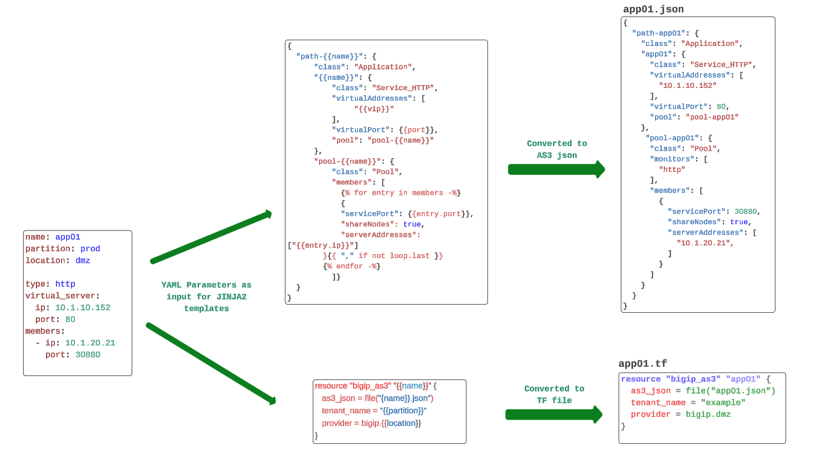
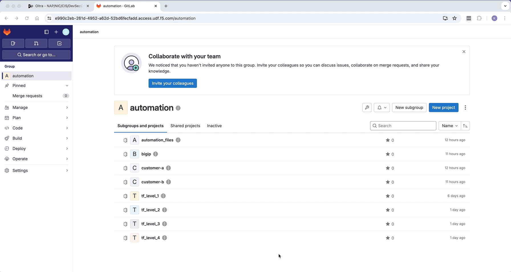
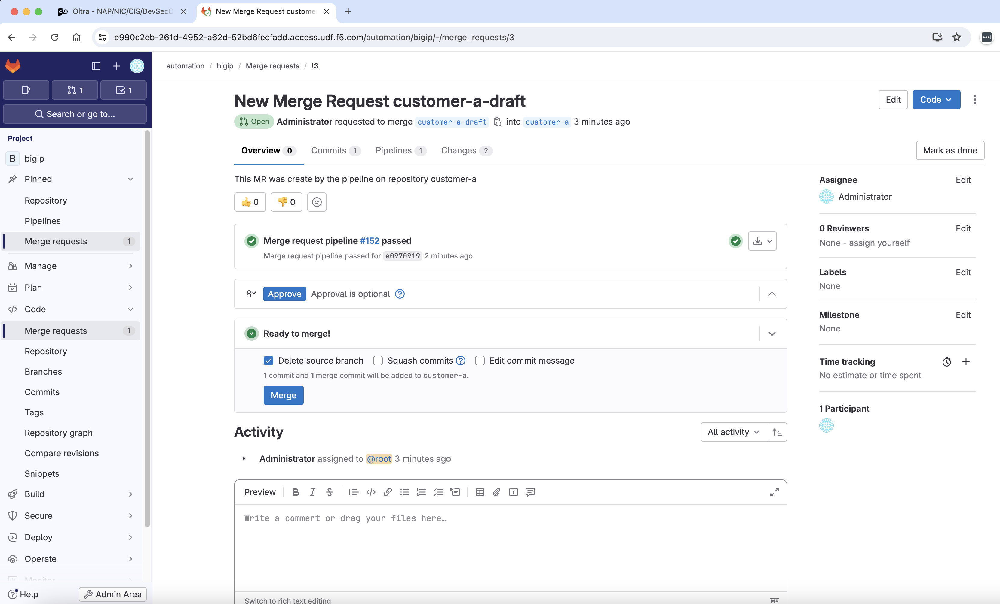

# Empowering Customers to Create Their Own Configurations

In `Level-5`, we enhance the automation framework to enable customers or teams to create their own configurations for the BIG-IP platform. In this scenario, each customer/team manages their own Git repository, where they can make changes and commit configurations. The pipeline will then convert the configuration to **Per-App AS3** and push the changes to a downstream repository on a specific branch, allowing BIG-IP admins to review and approve the merge requests.


# Table of Contexts

- [Use case workflow](#use-case-workflow)
- [Code Explanation](#code-explanation)
  - [Pipeline](#pipeline)
- [Demo](#demo)

## Use case workflow
The workflow for this use-case is as follows:

- **Customer Repositories:**
    - Each customer/team has their own Git repository where they can manage their configurations.
    - Customers/teams create and modify YAML files that reflect the configuration that is needed.
    - When a customer commits a change to their repository, a CI/CD pipeline is triggered.
    - The pipeline converts the YAML file to an AS3 and Terraform configuration and pushes the changes to a downstream repository, specifically to a designated branch for that customer/team.
    - The pipeline will create a merge request on the downstream repository for that particular branch 
- **Downstream Repository:**
    - The downstream repository contains branches for each customer/team.
    - BIG-IP admins monitor the downstream repository for new merge requests.
    - Admins review the proposed changes, provide feedback if necessary, and approve the merge requests.
    - Once approved, the changes are merged into the customer's branch and be deployed to the BIG-IP platform with the use of Terraform and AS3

## Code Explanation

### User configuration files (YAML)
To enhance usability, users only need to define the parameters of the service they intend to publish and save them in a YAML file format. YAML was selected for its user-friendly interface, which is both intuitive and familiar to DevOps users. Alternatively, customers may opt to utilize a ServiceNow ticket or a REST-API/web form, enabling their users to input the required information seamlessly. An example of the YAML parameters is shown below 

```yml
# Filename app01.yml
---
name: app01
partition: prod
location: dmz
comments: This is a new web server for testing
type: http
virtual_server:
  ip: 10.1.10.152
  port: 80
members:
  - ip: 10.1.20.21
    port: 30880
```

### Converting YAML to AS3 and TF configuration
Once the user defines the configuration they want to apply in the YAML file, this needs to be converted to:
- Per-App **AS3** JSON declaration 
- Terraform **bigip_as3** resource

To streamline the conversion of YAML to AS3 and TF, we leverage JINJA2 templates. These templates dynamically incorporate input from YAML file(s) as variables, facilitating the generation of the final AS3 JSON and TF config files. This seamless integration occurs within the CI/CD pipeline framework and is orchestrated through an Ansible playbook for efficiency and the resulting AS3/TF configurations are being stored in the downstream (BIG-IP) repository. 

<p align="center">
  
</p>

Below you can find the ansible playbook that we are using to achieve the transformation. The ansible **templates** and **playbook** can be found on the folders `Jinja2` and `Ansible`.  
```yml
---
- name: Create Per-App AS3 configurations
  hosts: localhost
  gather_facts: no

  tasks:
    - name: Create AS3 JSON
      ansible.builtin.template:
        src: templates/http.j2
        dest: temp_as3

    - name: Pretty Print AS3
      shell: jq . temp_as3 > as3/{{name}}.json

    - name: Create TF config file
      ansible.builtin.template:
        src: templates/tf.j2
        dest: tf/{{name}}.tf
        
```

### User Repositories and pipeline
Each customer creates their configuration files in YAML format on their repository. When a new file is added, modified, or deleted, the pipeline is triggered, proceeding through the following stages:

  - **Template Conversion**: This is the first stage that utilizes JINJA2 templates to translate the YAML files into corresponding AS3 declarations and TF configuration. The resultant output is stored in two distinct directories, **tf** and **as3**, and passed on to the next stage as an artifact.
  - **GIT**: In this second and final stage, the pipeline pushes the files residing in the as3 and tf directories to the upstream repository that is the source of truth for BIG-IP configuration.

The pipeline configuration for the User reposistories can be found under the `Pipelines` folder.


### BIGIP Repositories and pipeline
The BIG-IP repositories serve as repositories for AS3 declaration and TF files generated from the YAML specifications. They act as the definitive source of truth for configuring **F5 BIG-IP** and facilitate version-controlled management. While our example employs a single BIG-IP, the use-case can be adapted utilizing the `providers.tf` to have multiple BIGIP devices.

Each customer is assigned 2 branches on **BIGIP** repository. The first branch is named after the customer's repository and it is the primary branch while the second branch is a temporary branch that each customers will push their changes for their upstream repository. 

Within the BIG-IP repository, we've implemented a pipeline very similar to  `Level-4`. The pipeline configuration for the BIGIP reposistories can be found under the `Pipelines` folder.

The pipeline configuration for the bigip repos can be found on the following [**file**](https://github.com/f5emea/oltra/use-cases/automation/bigip/pipelines/bigip-pipeline.yml)


## Demo
> [!IMPORTANT]
> To run this Demo on your local environment, switch to the `Main` branch

### Step 1. Review the repositories
Access the web interface **GitLab** that is under the `bigip-01` on the `Access` drop-down menu. Click <a href="https://raw.githubusercontent.com/f5devcentral/bigip-automation/main/images/gitlab.png"> here </a> to see how.

Log on to GitLab using the root credentials (**root**/**Ingresslab123**) and review the 4 repositories that will be used in the use case.

- `customer-a` and `customer-b` are the two repos that are used to save the highlevel VirtualServer configuration in a YAML format.
- `bigip` is the repository that holds all the AS3 JSON files that serve as the source of truth for the BIG-IP. For simplicity, the configuration for each customer is stored on a separate branch 
- `automation_files` is the repo that holds all the pipelines, Ansible playbooks and JINJA2 templates

<p align="center">
  
</p>

### Step 2. Create the YAML file with the required key value pairs

We will create a new file on `customer-a` repository called **`app01.yaml`** and the file will contain the following configuration

```yaml
name: app01
partition: prod
location: dmz
type: http
virtual_server:
  ip: 10.1.10.152
  port: 80
members:
  - ip: 10.10.10.11
    port: 80
  - ip: 10.10.10.12
    port: 80
```

<p align="center">
  
</p>

### Step 3. Review the pipeline stages on `customer-a` repository

Select "Pipelines" on the left side of the GitLab page and review the pipeline that was just executed from your latest commit

<p align="center">
  
</p>


### Step 4. Review the Merge Request on BIGIP repo

Go to the BIGIP repository and and select the Merge Requests (MR). You should see a MR from `customer-a`. Open the MR and Navigate through the different tabs/pages going through the **Pipeline**, **Commits** and **Changes**.

<p align="center">
  
</p>

> Notice that there is a new **Temporary** Branch that has been created for the change, called `customer-a-draft`. This should be deleted when the MR is approved.


### Step 5. Approve the Merge Request

Once you have reviewed the MR, you should then approve the Merge Request. Once approved, the changes should be pushed to the **Branch** that holds the configuration for `customer-a` and the **Final** pipeline should start. 

<p align="center">
  
</p>


### Step 6. Review Pipeline outcome

Once the MR is approved, the pipeline should run **Terraform plan/apply** in order to push the configuration to BIGIP. Please review the pipeline steps going through the logs and artifacts.

<p align="center">
  
</p>
