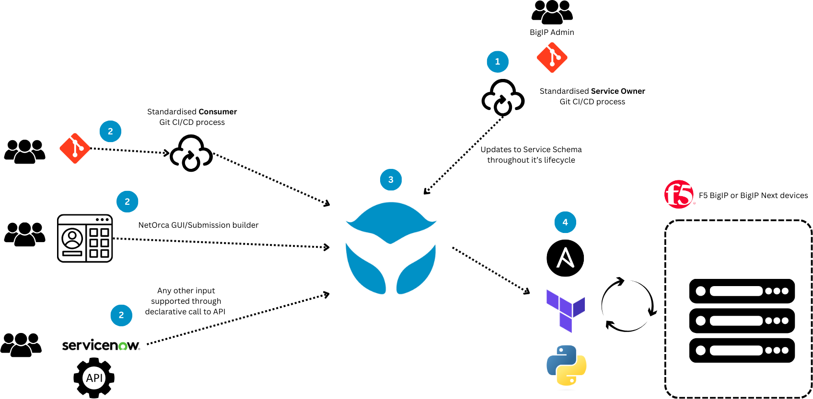
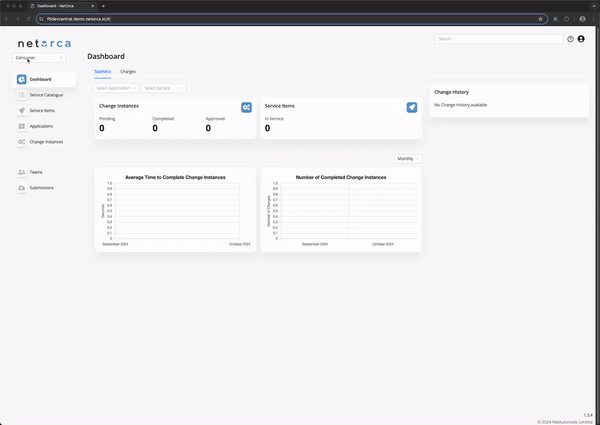

# Full lifecycle self-service

In **Level-6**, we evolve the automation framework into a scalable, customer-centric solution that supports full lifecycle self-service. 
To do this we utilise the **NetOrca** product provided by **NetAutomate** which provides an orchestration layer to abstract how a service is offered vs how it is requested by the customer. 

As a result, our diagram is updated as follows:

### Overview
NetOrca eliminates the need for an 'infrastructure as code' repository for the BigIP team, Allowing for their declarations to be derived directly from the customer requested state. 

The repositories that the BigIP team now own are for defining the service schema, and managing the terraform/ansible plays that are required to push the config to BigIP.

Customers/Consumers of services offered through NetOrca can use their existing infrastructure Git repositories, leveraging a predefined template and CI/CD process. They can put requests for load-balancers direct into this repo and track the status of this infrastructure via the NetOrca GUI. 

We will also demonstrate an option to do this exclusively through the GUI for teams that may not want to use Git. 

# Table of Contexts

- [Use case workflow](#use-case-workflow)
- [Code Explanation](#code-explanation)
  - [Pipeline](#pipeline)
- [Demo](#demo)

## Benefits

Level-5 started to reach the limits of best-practice just using Git repos and Terraform. It works well for a small scale deployment but at large scales it starts to have a number of issues. All of these issues are potentially addressed by adding an orchestration layer in the middle. 

Level-6 does this using NetOrca. 

The benefits to this are:
- **Customer Input**
  - Customer CI/CD process is simplified, it no longer needs to build the AS3 in the pipeline and is more easily consumed. 
  - Delete and Modify are directly supported from the customer repository
  - Synching between an upstream and downstream repo is no longer required.
  - Complexity is abstracted, no need for Customers to ever see AS3, even in a CI/CD process. 
- **Customer Feedback**
  - NetOrca shows the state of a customer request and when it is deployed onto the infrastructure, in this way Customers can see exactly when their request is deployed, and also what it's deployed state is at any one time (without having to look in and understand another repos Terraform state file).
- **Service Ownership**
  - the BigIP team is now able to change the customer input requirements as their service evolves. A change to the service schema requires no changes in CI/CD pipelines or the process and could be applied to new services only, not effecting existing Customers until they wanted to modify.
  - Downstream repository is optional. Service Owners can now use the NetOrca database as the source of truth, removing the need for a infrastructure repository
  - State is tracked, Terraform is no longer necessary as the state changes can be tracked in the orchestrator. More simplified tools can be used to push changes and these can be used by less experienced engineers (or a NOC)

## General Workflow explanation

1. Service Owners define the Service they offer in JSON Schema (including validation), which is published via a standard Git repository and CI/CD process. This is then published via a standard Git Repo and CI/CD process
   1. This process allows for future modifications of the schema throughout the lifecycle
2. Consumer teams have multiple options to request instances of this Service either by:
   1. Git repo and standardised CI/CD process
   2. NetOrca GUI input, which can later be moved to Git
   3. Any other service calling the NetOrca declarative service api.
3. NetOrca manages changes from multiple customer inputs, it raises Change Instances either CREATE, DELETE, or MODIFY
4. Any method can be used to deploy to F5 devices, we will include Ansible and Terraform deployment examples in this project. 

## Demo
> [!IMPORTANT]
> `UDF` environment is not available for this level.

### f5devcentral NetOrca demo instance details:
- **url**       ->        https://f5devcentral.demo.netorca.io/
- **username**  ->        f5devcentral
- **password**  ->        netorcaf5

### Customer Demo

In this demo we have two customer teams set up:

- [Customer A - Requests via GIT](customer_a/README.md) 
  - Customer A has an associated Git repository here: https://gitlab.com/netorca_public/bigip-automation/level-6/customer-a

- [Customer B - Requests via GUI](customer_b/README.md)

### Service Owner Demo

We also have separated out the Service Definition and processing repos for the Service Owner below:

- [BigIP Team - Defining and declaring a Service onto NetOrca](bigip_team/README.md)
  - Repo: https://gitlab.com/netorca_public/bigip-automation/level-6/service-owner-bigip-team
- [BigIP Team - Processing customer requested changes from NetOrca](bigip_team_processing/README.md)
  - Repo: https://gitlab.com/netorca_public/bigip-automation/bigip-team-automation

### NetOrca GUI:
1. Context switching:
  - NetOrca gives you the ability to be a Service Owner and a Customer.
  - You can offer your services as a Service Owner and in the same time request other services from the same NetOrca instance.

2. Team switching:
  - NetOrca allows users to be a part of multiple teams and switch between them easily. 
  - This is helpful when you are working with multiple teams and need to view the state of a team's requests, or submit requests for them

---
