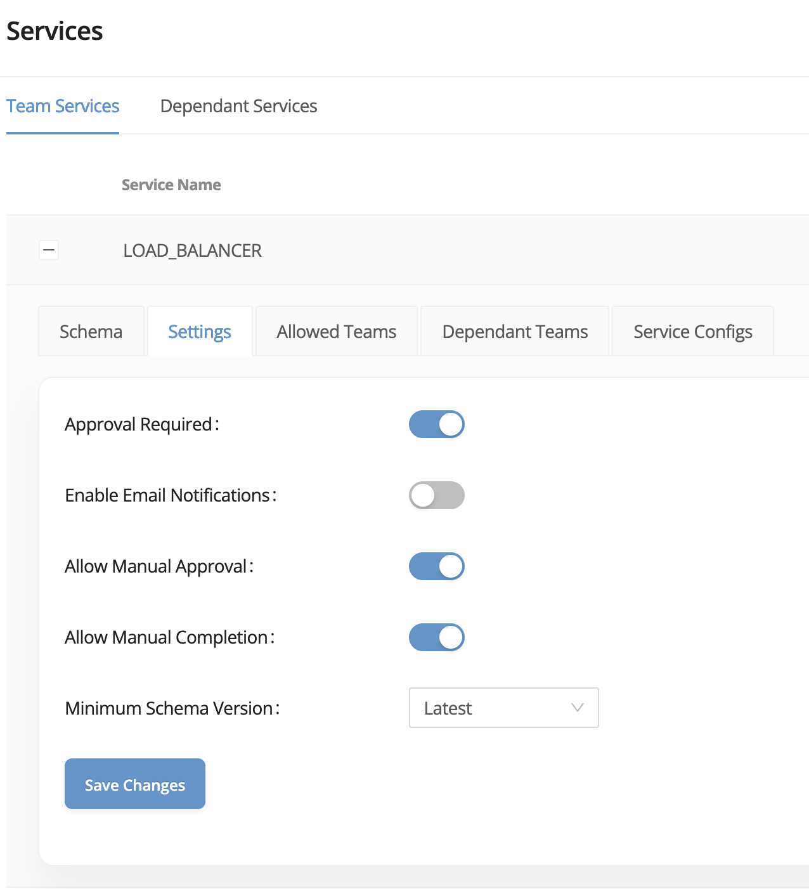

# Overview

Service Owners are responsible for creating and maintaining Service definitions in NetOrca. These Services are defined in JsonSchema format and stored in a GitLab repository. Any changes to Service definitions are managed through GitLab and submitted to NetOrca via a standardized CI/CD pipeline.

The repository referred to in this example is here: https://gitlab.com/netorca_public/bigip-automation/level-6/service-owner-bigip-team

### Service Owners - Schema Updates

The Service Owner workflow for updating Schemas is:

1. Make the required schema changes in the Git repository.
2. Create a merge request to the main branch. The build will run validation checks and report any issues.
3. Once merged, the build will submit the updated schema to NetOrca.


## Service Owner Flow

### Step 1. Create Service Definition in JSONSchema Format

This JSONSchema should:
1) Define the required an optional fields for an instance of this Service
2) Define validations for each field

Any validations created within the JSONSchema can be applied as 1st Level validations, meaning they will be checked within the customers CI/CD process.<br>
This gives the customers immediate feedback for any errors allowing them to quickly correct them before submitting. This also stops unnecessary Change Instances being created. 

This JSONSchema would be added to the .netorca folder of the Service Owners repo. 


<details>
  <summary>***Click to show JSONSchema example***</summary>

  ```json
  {
      "$id": "https://example.com/service.schema.json",
      "$schema": "https://json-schema.org/draft/2020-12/schema",
      "type": "object",
      "title": "LITTLE_LOAD_BALANCER",
      "metadata": {
        "monthly_cost": 100,
        "cost_per_change": 500
      },
      "properties": {
        "name": {
          "type": "string",
          "pattern": "^([a-z]{1}[a-z0-9-]{1,60})$",
          "examples": [
            "app01",
            "webserver01"
          ]
        },
        "partition": {
          "type": "string",
          "enum": ["prod", "dev", "sit", "uat", "qa"],
          "examples": [
            "prod",
            "dev"
          ]
        },
        "location": {
          "type": "string",
          "examples": [
            "dmz",
            "internal"
          ]
        },
        "comments": {
          "type": "string",
          "examples": [
            "This is a new web server for testing"
          ]
        },
        "type": {
          "type": "string",
          "enum": ["http", "https", "tcp"],
          "examples": [
            "http",
            "https"
          ]
        },
        "virtual_server": {
          "type": "object",
          "required": ["ip", "port"],
          "properties": {
            "ip": {
              "type": "string",
              "pattern": "^((25[0-5]|2[0-4][0-9]|[01]?[0-9][0-9]?)\\.){3}(25[0-5]|2[0-4][0-9]|[01]?[0-9][0-9]?)$",
              "examples": [
                "10.1.10.152"
              ]
            },
            "port": {
              "type": "integer",
              "examples": [
                80,
                443
              ]
            }
          }
        },
        "members": {
          "type": "array",
          "items": {
            "type": "object",
            "required": ["ip", "port"],
            "properties": {
              "ip": {
                "type": "string",
                "pattern": "^((25[0-5]|2[0-4][0-9]|[01]?[0-9][0-9]?)\\.){3}(25[0-5]|2[0-4][0-9]|[01]?[0-9][0-9]?)$",
                "examples": [
                  "10.1.20.21",
                  "10.1.20.22"
                ]
              },
              "port": {
                "type": "integer",
                "examples": [
                  30880,
                  30881
                ]
              }
            }
          }
        }
      },
      "required": [
        "name",
        "partition",
        "location",
        "type",
        "virtual_server",
        "members"
      ],
      "description": "New load balancer on F5 BigIP"
  }
```
</details>


### Step 2. Create a README.md File with Explanation of the Service and Example Usage

Any .md file that is within the ServiceOwners repository and has the same name as an associated Service, will be uploaded to NetOrca. <br>
These READMEs will be shown in the Service Catalogue page of NetOrca and will serve as the first point of references for customers that are looking to utilise the Service. 

These .md files are held within the ServiceOwner repo for ease of maintenance as they can be frequently updated as customer feedback is received and more questions need to be answered/explained.

This example .md file would be added to the .netorca folder of the Service Owners repo. 

<details>
  <summary>***Click to show README file example***</summary>

  ># Load Balancer Service
  >
  >BigIP Load Balancer service
  >
  >### Schema Fields
  >
  >- **name**: The name of the load balancer (string).
  >  - Must follow the pattern `^([a-z]{1}[a-z0-9-]{1,60})$`.
  >  - Examples: `app01`, `webserver01`.
  >  
  >- **partition**: The environment in which the load balancer resides.
  >  - Enum: `prod`, `dev`, `sit`, `uat`, `qa`.
  >  
  >- **location**: The network location, such as `dmz` or `internal`.
  >  
  >- **type**: The protocol type of the load balancer.
  >  - Enum: `http`, `https`, `tcp`.
  >
  >- **virtual_server**: The IP and port of the load balancer’s virtual server.
  >  - Fields:
  >    - `ip`: IPv4 address of the virtual server.
  >    - `port`: Port number for the virtual server.
  >
  >- **members**: A list of IP addresses and ports for backend servers (array).
  >  - Each member has:
  >    - `ip`: IPv4 address of the backend server.
  >    - `port`: Port number for the backend server.
  >
  >## Example Usage
  >
  >The following is an example configuration in YAML format that aligns with the JSON schema.
  >
  >### Example Configuration
  >
  >```yaml
  >---
  >application1:
  >  services:
  >    LOAD_BALANCER:
  >      - name: load_balancer1
  >        partition: prod
  >        location: dmz
  >        comments: This is a new web server for testing
  >        type: http
  >        virtual_server:
  >          ip: 10.1.10.152
  >          port: 80
  >        members:
  >          - ip: 10.1.20.21
  >            port: 30880
  >```
</details> 


### Step 3. Create a Merge Request with the Changes, Merge to Main Branch

Once the above files are added to the .netorca folder, the Service Owner team would then create a merge request to the main branch with these changes.<br>
This merge request would kick of a Service Owner CI/CD process to validate the Service schemas. 

In a merge request this Service will not be made live yet, but it will be checked and the CI/CD process will report back any validation errors or errors with the JSONSchema format.<br>
These can then be corrected before merge to main. 

After merging to the main branch, the CI/CD pipeline will be triggered, and the new Service will be available in NetOrca. <br>
This can be verified by looking at the Services in the Service Owner view, or by looking at the Service Catalogue in the Consumer view. 


### Step 4. Modify Required Service Settings in the NetOrca GUI

NetOrca allows Service Owners to control the behavior of the Service and Service Items with the following settings:
- **Approval Required**: By default, new Change Instances are preapproved, but Service Owners can change this to manual (or automatic) approval.
  * Useful when Service Owners need to perform validations in external services before approving changes.
- **Enable Email Notifications**: Service Owners will be notified about new Change Instances.
- **Allow Manual Approval**: Service Owners can approve/reject Change Instances in the NetOrca GUI.
- **Allow Manual Completion**: Service Owners can complete Change Instances in the NetOrca GUI.
- **Minimum Schema Version**: Service Owners can set the minimum schema version that Customers can request.
  * This feature allows backward compatibility for already existing Service Items when services are upgraded.



### Step 5. Explore Advanced Features (Versioning, Backward Compatibility, Service Configs, Allowed Teams, Dependent Teams)

NetOrca offers a robust set of features to manage and configure services:

- **Versioning**: Each Service can have multiple versions, enabling easy rollbacks or comparisons of changes.
- **Backward Compatibility**: NetOrca ensures that new versions of a Service are compatible with older versions, preventing breaking changes.
- **Service Configs**: Services can have multiple configurations to allow customization based on different environments or requirements.
- **Allowed Teams**: Services can be restricted to specific teams, ensuring only authorized personnel can access or modify them.
- **Dependent Teams**: Changes to a Service will also trigger changes in the dependent teams if applicable.

Please consult the NetOrca docs for more information/use-cases on these features. 
