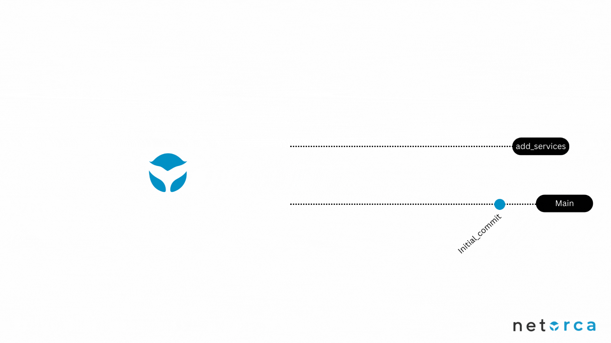

# Overview
Service Owners are responsible for creating and maintaining Service definitions that they offer via NetOrca.<br>
Services are defined in JsonSchema format which are then stored in GitLab repository.<br>
All changes to the Service definitions are done via GitLab repository and submitted to NetOrca via CICD pipeline.


### Service Owners - Schema Updates

The Service Owner workflow for updating Schemas is:

1. Make required schema changes within GitRepo
2. Create merge request to main, build will run validation check and report any issues
3. Merge, build will submit updated schema to NetOrca



## Service Owner flow
### Step 1. Create Service definition in JsonSchema format

```md
{
    "$id": "https://example.com/service.schema.json",
    "$schema": "https://json-schema.org/draft/2020-12/schema",
    "type": "object",
    "title": "LITTLE_LOAD_BALANCER",                                    #<---- `title` is unique identifier of the Service in NetOrca
    "metadata": {                                                       #<---- `metadata` is a place where Service Owner can put any information about the Service
      "monthly_cost": 100,                                              #<---- one of NetOrca features is Charging API
      "cost_per_change": 500
    },
    "properties": {
      "name": {                                                         #<---- `name` is the only required property in the Service definition
        "type": "string",
        "pattern": "^([a-z]{1}[a-z0-9-]{1,60})$",                       #<---- jsonschema offers powerful validation capabilities like enums, regex, lists, objects in objects etc
        "examples": [
          "app01",
          "webserver01"
        ]
      },
      "type": {
        "type": "string",
        "enum": ["http", "https", "tcp"],                               
        "examples": [
          "http",
          "https"
        ]
      },
      "virtual_server": {
        "type": "object",
        "required": ["ip", "port"],
        "properties": {
          "ip": {
            "type": "string",
            "format": "ipv4",
            "examples": [
              "10.1.10.152"
            ]
          },
          "port": {
            "type": "integer",
            "examples": [
              80,
              443
            ]
          }
        }
      }
    },
    "required": [
      "name",
      "type",
      "virtual_server",
    ],
    "description": "New load balancer on F5 BigIP"
  }
  
```


### Step 2. Create README.md file with explanation of the Service and example usage

```md
# Little Load Balancer Service

BigIP Load Balancer service


### Schema Fields

- **name**: The name of the load balancer (string).
  - Must follow the pattern `^([a-z]{1}[a-z0-9-]{1,60})$`.
  - Examples: `app01`, `webserver01`.

- **type**: The protocol type of the load balancer.
  - Enum: `http`, `https`, `tcp`.

- **virtual_server**: The IP and port of the load balancer’s virtual server.
  - Fields:
    - `ip`: IPv4 address of the virtual server.
    - `port`: Port number for the virtual server.

## Example Usage

The following is an example configuration in YAML format that aligns with the JSON schema.

### Example Configuration

```yaml
---

application1:
  services:
    LITTLE_LOAD_BALANCER:
      - name: load-balancer1
        type: http
        virtual_server:
          ip: 10.1.10.152
          port: 80
```


### Step 3. Create a Merge Request with the changes, merge to main branch

> - after merge to main branch, CICD pipeline will be triggered and new Service will be available in NetOrca
> - check the Service in NetOrca Service Catalog


### Step 4. Modify required Service settings in NetOrca GUI

> - NetOrca gives ability to control behaviour of the Service and Service Items with the following settings:
> - "Approval Required" - by default new Change Instances are preapproved, but Service Owner can change it to manually (or automatically) approve Change Instances
>   * useful in cases where Service Owner needs to do some validations in external services before approving changes
> - "Enable email notifications" - Service Owner will be notified about new Change Instances
> - "Allow Manual Approval" - Service Owner can approve/reject Change Instances in NetOrca GUI
> - "Allow Manual Completion" - Service Owner can complete Change Instances in NetOrca GUI
> - "Minimum Schema Version" - Service Owner can set minimum schema version that Customer can request
>   * Services can be upgraded, this feature allows backward compatibility for already existing Service Items


### Step 5. Get familiar with ADVANCED FEATURES (Versioning, Backward Compatibility, Service Configs, Allowed Teams, Dependant Teams)

> - NetOrca offers a powerful set of features to manage and configure services.
> - Some of the key features include:
>   - Versioning: Each service can have multiple versions, allowing for easy rollback or comparison of changes.
>   - Backward Compatibility: NetOrca ensures that new versions of a service are compatible with older versions, preventing breaking changes.
>   - Service Configs: Services can have multiple configurations, allowing for customization based on different environments or requirements.
>   - Allowed Teams: Services can be restricted to specific teams, ensuring that only authorized personnel can access or modify them.
>   - Dependant Teams: Services can have dependant teams, meaning that changes to the service will also trigger changes in the dependant teams.