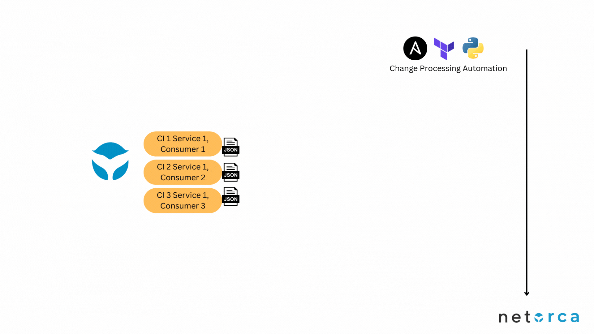
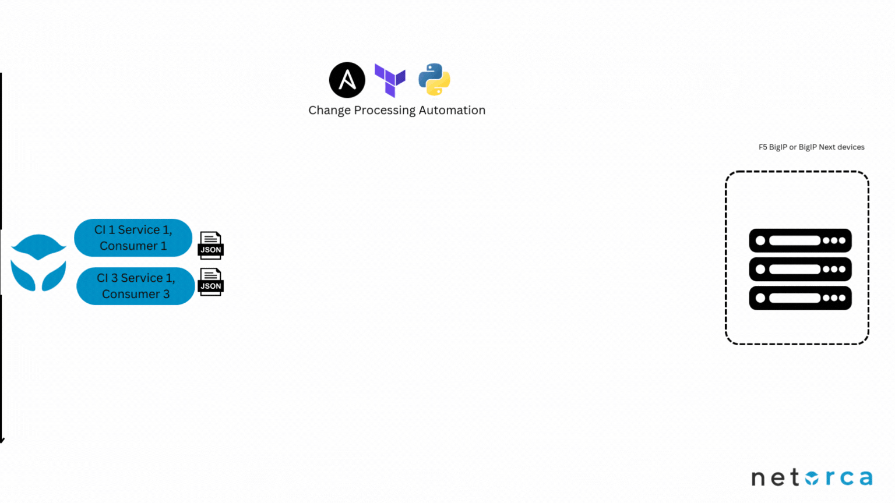

# Overview
Service Owner teams are responsible for creating and maintaining their Services in NetOrca, as detailed in [BIGIP_TEAM](../bigip_team/README.md).  
Another key responsibility is to manage requests in the form of Change Instances submitted by Customers. Service Owners must establish a workflow for processing these Change Instances in their queue.

## Definitions
- **Service**: A well-defined piece of infrastructure that the Service Owner Team offers to Customers. It is defined using a JsonSchema and processed as part of the infrastructure implementation. Examples include Web Servers, Load Balancers, and Firewalls.
  
- **Service Item**: An instance of a Service requested by a Customer, characterized by a name and a set of parameters defined in the Service JsonSchema. It reflects the current state of a Customer request.

- **Change Instance**: A modification requested by a Customer to a Service Item. Change Instances can represent CREATE, MODIFY, or DELETE operations. They are reviewed and either APPROVED, REJECTED, or COMPLETED by the Service Owner. Approved Change Instances are implemented as infrastructure.

## Processing Change Instances
Change Instances are handled according to a workflow defined by the Service Owner. NetOrca supports workflows through state transitions of Change Instances, which can be processed manually via the GUI or programmatically via the API. We recommend using an automation-first approach with the API to enhance reliability and streamline workflows.

### General Workflow for Service Owners

Customers submit changes to Services as Change Instances on NetOrca. These requests move through a two-stage process:

1. **Validation Stage** (Optional): The Service Owner reviews the Change Instance, performing any necessary validation before approval. Validation can be automated or manual.
   
2. **Deployment Stage**: Once approved, Change Instances are implemented in the infrastructure.

#### Validation Stage

The validation stage can be automated using tools like Ansible or third-party platforms. The process typically follows these steps:

1. Retrieve PENDING Change Instances from the NetOrca API.
2. Use a playbook or script to validate the changes.
3. If valid, mark the Change Instances as APPROVED.

#### Deployment Stage

After validation, the Service Owner team deploys approved changes:

1. Retrieve APPROVED Change Instances from the NetOrca API.
2. Extract the Consumer's Service Item declarations and convert them into AS3 format.
3. Submit the AS3 declarations to BigIP devices.
4. If successful, mark the Change Instance as COMPLETED.

This process applies to CREATE, MODIFY, and DELETE operations and can be performed either imperatively or declaratively.

## Change Instance Lifecycle
Change Instances move through the following states:

- **PENDING**: The Change Instance is created and awaits validation or approval.
- **PENDING → APPROVED**: The Change Instance is validated and approved.
- **PENDING → REJECTED**: The Change Instance fails validation and is rejected.
  
- **APPROVED**: The Change Instance is ready for deployment.
- **APPROVED → COMPLETED**: The Change Instance has been successfully deployed.
- **APPROVED → ERROR**: The Change Instance failed to deploy due to an error.

## Workflow Scenarios

### Step 1. Customer Submits a New Service Item

This step is explained in detail in [CUSTOMER_A](../customer_a/README.md) and [CUSTOMER_B](../customer_b/README.md).

### Step 2. Service Owner Reviews the Change Instance

Service Owners must review Customer requests and either approve or reject the Change Instance. Depending on the Service configuration, Change Instances can be automatically approved or require manual approval.

#### Step 2.1. Change Instance is APPROVED

Approved Change Instances are ready for deployment. Approval can be configured to occur via:

- Pre-approval
- GUI-based approval
- API-based approval

Refer to the NetOrca documentation for more details.

### Step 3. Change Instance is Deployed

This stage transitions a Change Instance from APPROVED to COMPLETED, effectively implementing the Customer request. Automation tools such as Ansible or Terraform are typically used for deployment. The deployment process generally follows these steps:

1. Fetch APPROVED Change Instances for a specific Service.
2. Apply any custom logic (e.g., filtering by environment).
3. Extract declarations from linked Service Items.
4. Translate the declarations into a format supported by the infrastructure (e.g., BIG-IP AS3).
5. Implement any additional logic (e.g., partitioning, object requests to external systems).
6. Deploy the change and mark the Change Instance as COMPLETED if successful.

#### Step 3.1. Automated Deployment with Ansible

Two Ansible playbooks are available for validation and deployment:

- [VALIDATION Playbook](https://awx.netorca.io/#/templates/job_template/41/details): Moves PENDING Change Instances to APPROVED.
- [DEPLOYMENT Playbook](https://awx.netorca.io/#/templates/job_template/42/details): Moves APPROVED Change Instances to COMPLETED by deploying them to F5 infrastructure.

#### Step 3.2. Automated Deployment with Terraform

#### Step 3.3. Manual Deployment

In cases where automation is not feasible (e.g., production environments), manual deployment can be performed while still using NetOrca to maintain audit trails and visibility into Customer requests.
