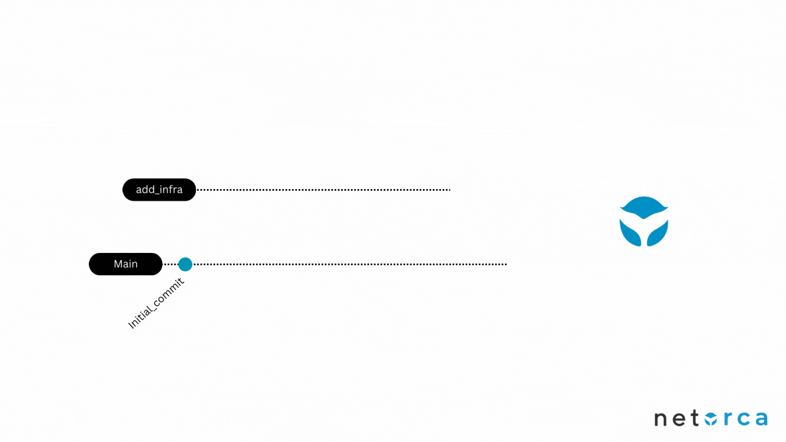
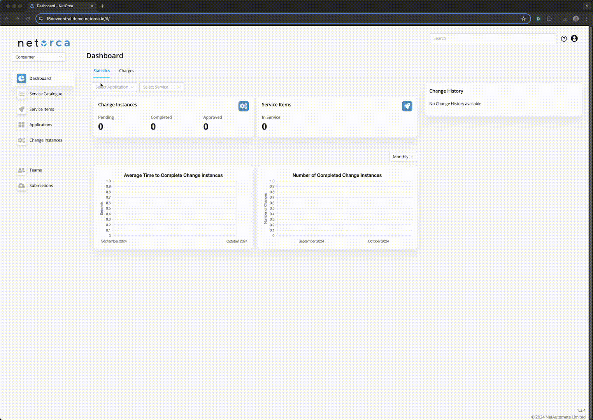
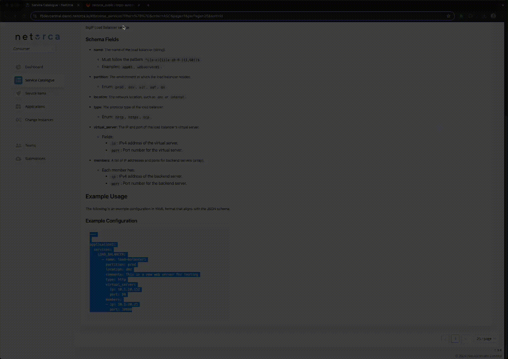
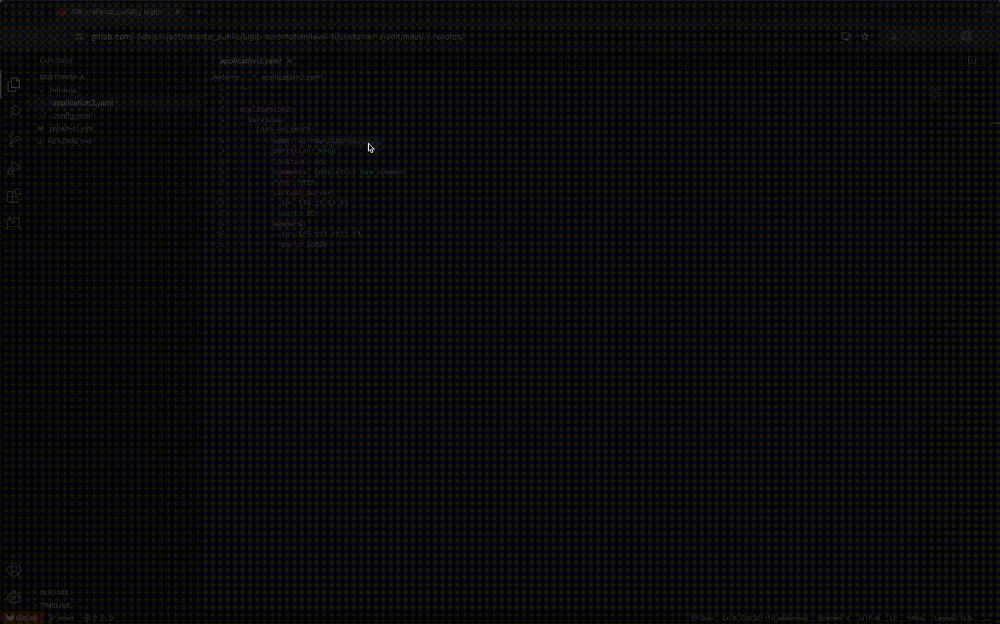
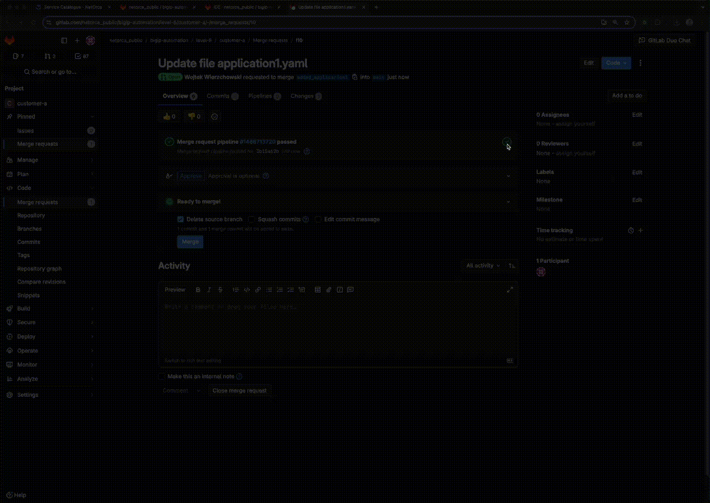
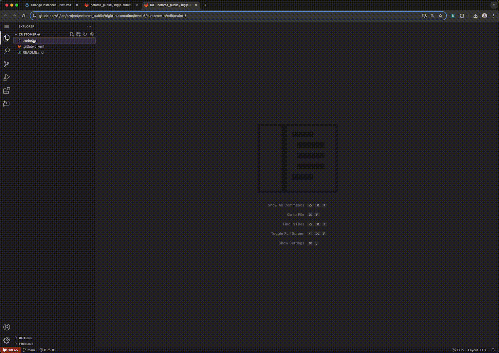
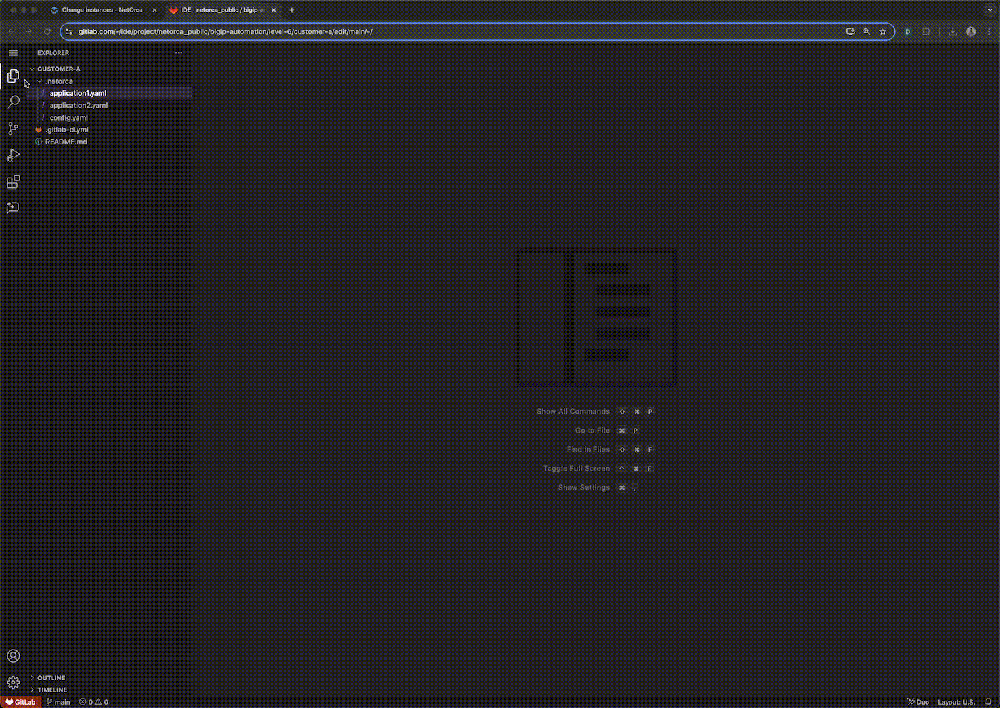
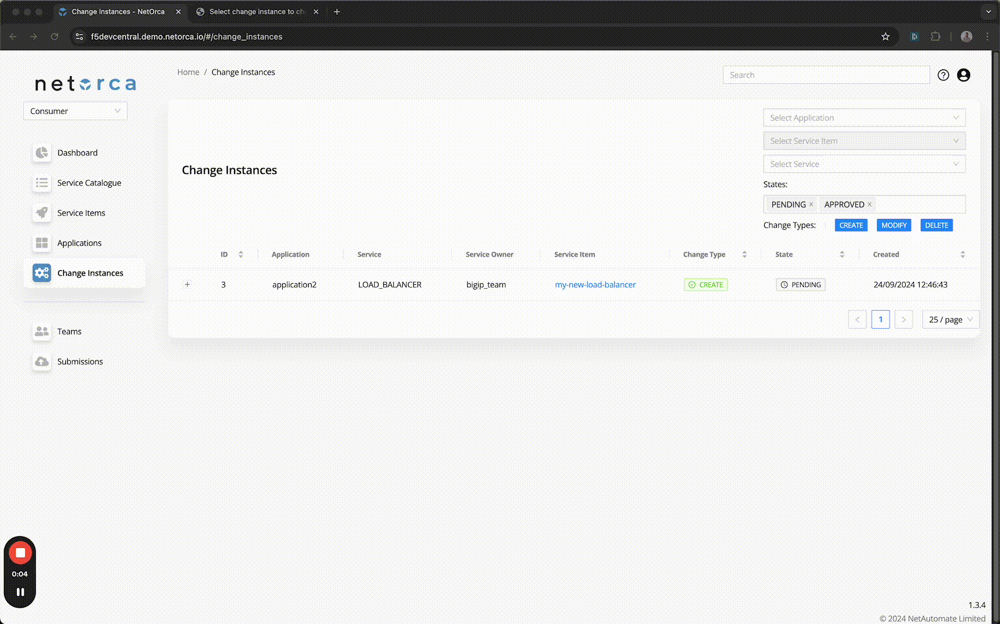

# Overview

This guide outlines how to interact with NetOrca in declarative/GitOps mode as a Customer. It requires a properly configured GitLab repository with a CI/CD pipeline and NetOrca integration. The GitOps model promotes transparency and collaboration, making it ideal for highly secure or regulated environments by enabling robust auditing and additional protections.

## Benefits of using GitOps mode:
- The Merge Request process allows teams to review changes before submission.
- All changes are version-controlled and visible in the GitLab repository.
- Changes are auditable and easily trackable.
- The repository serves as the single source of truth for the team's changes.

Repository used in this example:
[NetOrca Public Repository](https://gitlab.com/netorca_public/bigip-automation/level-6/customer-a)

## Declarative / GitOps Workflow

The customer workflow in declarative/GitOps mode follows these steps:
- Create a declaration for the Service in their Git repository.
- Create a merge request. The CI/CD pipeline will validate the declaration and report any errors for correction.
- Merge the declaration into the main branch. The CI/CD process will push it to NetOrca.
- In NetOrca, view the change instances. When they are marked as complete, the configuration has been deployed to the infrastructure.



### LOAD_BALANCER YAML Format

```yaml
---
# Filename app01.yml

application1:
  services:
    LOAD_BALANCER:
      - name: load_balancer1
        partition: prod
        location: dmz
        comments: This is a new web server for testing
        type: http
        virtual_server:
          ip: 10.1.10.152
          port: 80
        members:
          - ip: 10.1.20.21
            port: 30880
```

## Demo Walkthrough

### Step 1: Go to the NetOrca Service Catalog, find the Service you want to request, and obtain the example YAML definition.

> The Service Catalogue contains details for all Services offered via NetOrca.
> There are 3 tabs in the Service Catalogue:
> - **README**: Information about the Service provided by the Service Owner.
> - **Schema**: A detailed JsonSchema definition of the Service, where you can find details for each property.
> - **Example**: A generator for YAML/JSON code for the Service.



### Step 2: Define the service by either copying the README example or using the Submission Builder.

#### Step 2.1: Using the README example



#### Step 2.2: Using the Submission Builder


### Step 3: Request the service via your Customer A GitLab repository.

> - In this step, you will create a new branch, modify the example, create a merge request, and watch the pipeline for validation.
> - Your requests will be sent to NetOrca and validated against the Service definition.

#### Step 3.1: Validation successful

> - Once the pipeline is green, this indicates that the request is valid and can be merged to the main branch.



#### Step 3.2: Validation failed

> - If validation fails, the pipeline logs will display detailed error messages. These logs will identify the specific validation errors and provide descriptions to help with correction.
> - You will need to fix the request and update the merge request.


### Step 4: Merge the MR (Merge Request) into the main branch and monitor the CI/CD pipeline.

> - After the MR is merged, the submission job will be triggered and changes will be pushed to NetOrca.
> - NetOrca will determine the type of change (CREATE, MODIFY, DELETE) for each Service Item and create a corresponding Change Instance. If the Service Item's YAML is unchanged, no Change Instance will be created, as NetOrca operates in a declarative manner.

#### Step 4.1: CREATE Change Instance


#### Step 4.2: MODIFY Change Instance


#### Step 4.3: DELETE Change Instance


### Step 5: Check the status of your requests live in the NetOrca GUI.

> - At this stage, the responsibility for processing the customer request shifts to the Service Owner.
> - By default, the Change Instance will be in a PENDING state, awaiting approval from the Service Owner.
> - The APPROVED status indicates that the Service Owner has validated and approved the request.
> - The REJECTED status means that the Service Owner has rejected the request due to an issue.
> - The COMPLETED status indicates that the request has been successfully deployed on the BIG-IP system.



### Step 6: Repeat this process to maintain your Service Item throughout its lifecycle.

This process supports modification and deletion by default.

- **MODIFY**: To modify a Service Item, change the required fields in the YAML declaration. Create a merge request, check validation, then merge to main. This will resubmit to NetOrca, which will create a MODIFY Change Instance for processing.
- **DELETE**: To delete a Service Item, remove the corresponding YAML from the application file. Create a merge request, check validation, then merge to main. NetOrca will create a DELETE Change Instance, and once processed, the Service Item will move to the DECOMMISSIONED state.
